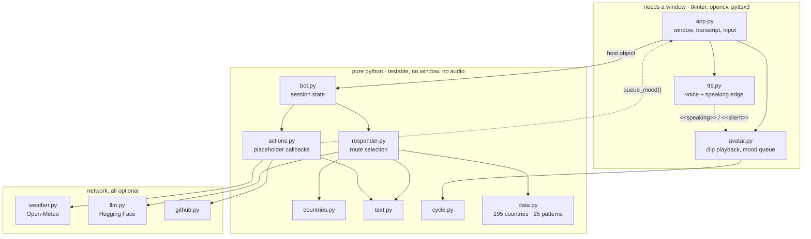
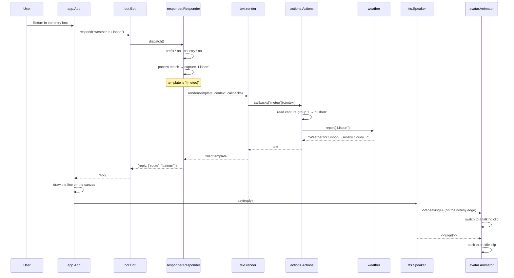

# Architecture

Thirteen modules, split along one line: does it need a window?



Nothing in `core` imports anything from `gui`. The GUI passes itself down as a
`Host` — three methods: `clear_transcript`, `request_quit`, `queue_mood`. With
no host (terminal mode, tests) those actions become no-ops instead of errors.

---

## One turn, end to end

What happens when someone types `weather in Lisbon`:



The two dashed arrows are the part worth looking at. The avatar is never told
how long to animate; it is told *that the voice started* and *that it stopped*.

---

## The dispatcher

```
dispatch(user_input)
  │
  ├─ empty?                          → (None, "empty")
  │
  ├─ starts with : ! . ?             → forced route
  │      :  eval      (needs --unsafe-code)
  │      !  exec      (needs --unsafe-code)
  │      .  patterns only
  │      ?  language model
  │
  ├─ pattern table                   → first regex that matches wins
  ├─ countries.answer()              → "capital of Peru"
  ├─ bare arithmetic                 → "12*12"
  ├─ exec fallback                   → only with --unsafe-code
  └─ default response                → always answers
```

Each step returns `(reply, metadata)`. `reply is None` means "not mine, keep
going". `reply == ""` means "handled, print nothing" — that is what lets the
`{clear}` response clear the screen and stay silent.

The metadata carries the winning route name. Tests assert on that rather than
on the sentence, because most responses are a random choice from a list and are
allowed to change.

### Order is a decision, not an accident

The pattern table runs **before** the country layer. The original had it the
other way round, which meant "weather in Lisbon" was answered with facts about
Portugal — Lisbon is a capital, and the country layer never looked at the rest
of the sentence. Patterns encode an explicit intent, so they get first refusal;
the country layer then catches anything that merely names a place. Two
regression tests pin this.

Within the pattern table, order is the order in `data.PATTERNS` — first match
wins, so specific patterns are listed above general ones. A test walks the table and fails if a
keyword pattern is completely shadowed by an earlier one (patterns built
around capture groups are skipped — they have no single literal to probe with).

---

## Placeholders

The data file knows nothing about clocks, networks or windows. It only knows
names:

```python
r'(?:weather in|temperature in|climate in)\s+(.+?)(?:…|[.?!]|$)': ['{meteo}']
r'\b(?:what time is it|the time|time)\b':  ["It's {time} o'clock"]
r'\b(?:clear chat|wipe screen|clear)\b':   ['{clear} Chat cleared. …']
```

`text.render` walks the template through a dict subclass whose `__missing__`
looks the name up in a callback map, calls it with the match context, and caches
the result so a name used twice is resolved once. An unknown name renders as
`<name?>` instead of raising — a typo in the data file then shows up in the chat
window rather than taking the app down mid-demo. A test asserts that no template
currently contains an unmapped name.

Because the callback receives the regex match, a placeholder can read what the
user actually said. `{meteo}` is one line in the data file and still gets the
city name.

---

## The avatar

25 MP4 clips in `assets/geopatra/`, 11 loaded at startup. `arrival` is decoded
synchronously so there is something on screen immediately; the rest decode on a
worker thread. Decoding happens off the main thread, but the `ImageTk` objects
are constructed back on it via `root.after(0, …)`. Tk is not thread-safe; the
original built them in the worker and got away with it.

Clip names are the state machine. `classify()` sorts them by substring:
anything containing `idle` is an idle clip, anything containing `neutral`,
`funny` or `rap` is a talking clip. Adding a mood means dropping a file in the
folder and naming it.

Playback is a 30 fps `after()` loop. Each clip is a `BounceCycle` — forwards,
then backwards, counting round trips. A new clip is only chosen at a completed
round trip, which is why mood switches land cleanly instead of jumping.

The mood queue is how a response reaches the avatar: `{joke}` in a template
calls `Actions.mood`, which calls `Host.queue_mood("funny_v1")`, which the
animator picks up at the next boundary.
